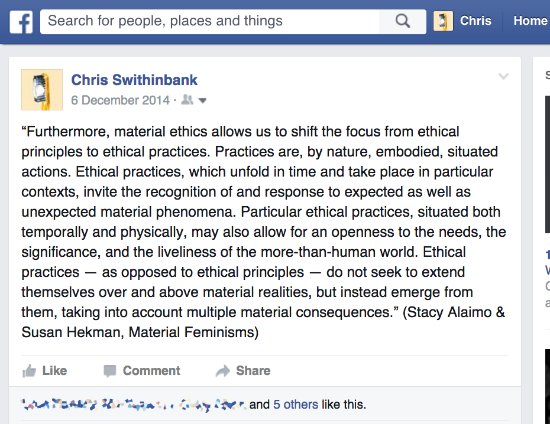
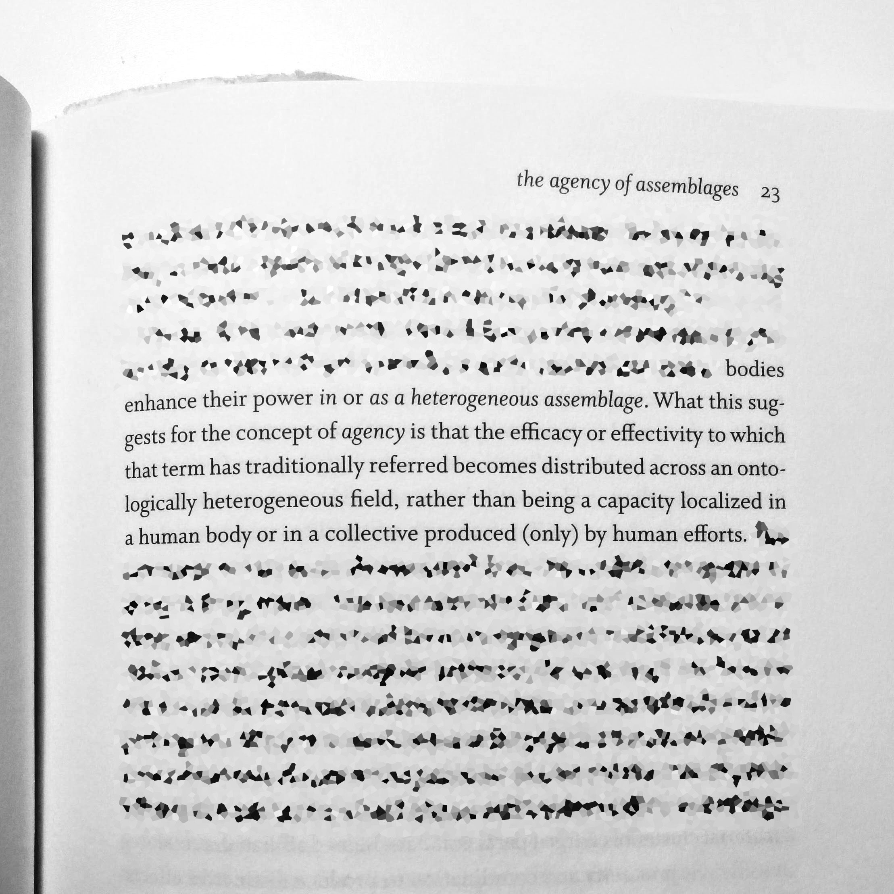

#### Colloquium
#### 22/2

Note:

---

Note:
Source: https://www.facebook.com/chris.swithinbank/posts/10101423363495555
---
> A practice is always a labour — a ‘work’ — on pre-existing materials and traces.

Stuart Hall, ‘Museums of Modern Art and the End of History’ (2001)
---
> The Spinozist account of the body is of a productive and creative body which cannot be definitively “known” since it is not identical with itself across time. The body does not have a “truth” or a “true nature” since it is a process and its meaning and capacities will vary according to context. We do not know the limits of this body or the powers that it is capable of attaining. These limits and capacities can only be revealed in the ongoing interactions of the body and its environment.

Moira Gatens, _Imaginary Bodies: Ethics, Power, and Corporeality_ (1996)
---

